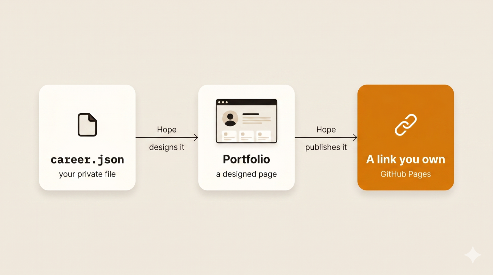
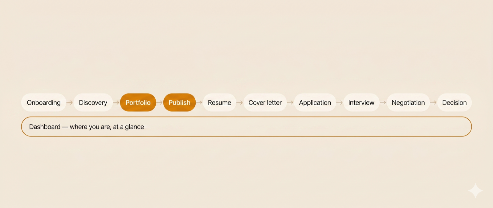
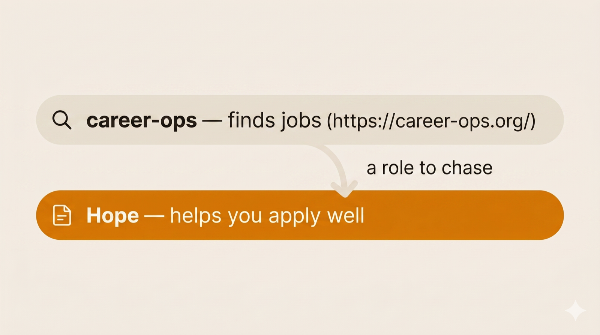

# JobHunt with Hope

> Tell Claude about your work. Get a designed portfolio website, a recruiter-ready résumé, and **one link you own** — free.

**[agenthope.ai](https://agenthope.ai)** · free · open-source (MIT) · your data never leaves your machine

I built Hope while job-hunting. The one thing I've submitted with it — my portfolio — is getting interview calls.

<!-- IMAGE: portfolio-hero — see tasks/readme-image-prompts/ for the generation prompt -->
<p align="center"></p>

## What you get

- **A portfolio website that looks designed, not like a form** — with a living timeline of your career that visitors can play, hover, and click. Busy years rise like mountain peaks. A little character of your choice travels it.
- **A résumé PDF recruiters respect** — pick a style and font; key phrases bolded for the 7-second skim; your links clickable; text never too small to read. Application systems read it perfectly.
- **One link you own** — published free to a page in *your* name. Paste it on LinkedIn and it unfurls with your own preview card. Visitors see a finished site; only you can change it.

## Start in two minutes

1. **Install** (in [Claude Code](https://claude.com/claude-code) or the Claude desktop app):
   ```
   /plugin marketplace add oneconsciousness/claude-job-hunt-with-hope
   /plugin install hope@hope
   ```
2. **Open a fresh chat in an empty folder** and type: **start my job hunt with Hope.**
3. Hand it what you have — a resume file, your LinkedIn, your GitHub, or just a conversation. Hope does the work and walks you to your live link.

> **What you need:** access to Claude (a paid plan or API billing). Hope itself is free.

**See it first:** the live demo at **[agenthope.ai](https://agenthope.ai)** is a portfolio Hope built for a fictional designer — play the timeline, flip the theme, try Save as PDF.

<!-- IMAGE: publish-flow — see tasks/readme-image-prompts/ for the generation prompt -->
<p align="center"></p>

## Your data stays with you

Your facts live in one file on your computer: `career.json` — your work, skills, and the roles you're chasing. Hope also keeps a small notebook, `user-story.md` — how you like to work and where you are in the hunt. Both files are yours: open them, edit them, delete them.

**No tracking. No accounts. Nothing leaves your machine** except the portfolio you choose to publish — to a page you own. The file format is documented in [`references/career-graph-schema.md`](references/career-graph-schema.md), if you want to look.

<!-- IMAGE: data-stays-home — see tasks/readme-image-prompts/ for the generation prompt -->
<p align="center"></p>

## How Hope talks to you

No forms, no jargon, no quizzes. Hope asks in simple choices you answer with a number, shows you what it means before it asks ("see the part glowing at the bottom?"), and never asks for what it already has — if your resume is in the folder, it just reads it. If you'd rather talk something through, every big question has a "chat about it first" option.

## The steps today

| Step | What it does | Say |
|---|---|---|
| Onboarding | Gets to know you from what you already have | "start my job hunt with Hope" |
| Portfolio | Builds your portfolio website + résumé | "make my portfolio" |
| Publish | Puts it online on a page you own | "publish my portfolio" |
| Update | Refreshes any of it, any time | "update my portfolio" |

**Coming in later releases:** weighing roles, tailored cover letters, applying with care, interview prep, negotiation, deciding, and a dashboard. They're designed and waiting — this release does presentation, and does it well.

<!-- IMAGE: journey — see tasks/readme-image-prompts/ for the generation prompt -->
<p align="center"></p>

## Works with your other tools

Hope installs next to other plugins without clashing. A good pair is **career-ops**: **career-ops finds jobs; Hope helps you apply well.**

career-ops: <https://github.com/santifer/career-ops>

<!-- IMAGE: works-with-career-ops — see tasks/readme-image-prompts/ for the generation prompt -->
<p align="center"></p>

## For the curious

- The design system (one calm look, light + dark): [`references/design-tokens.md`](references/design-tokens.md)
- How Hope speaks (plainly, honestly, no hype): [`references/voice-guide.md`](references/voice-guide.md)
- Contributing (written for humans *and* coding agents): [`CONTRIBUTING.md`](CONTRIBUTING.md)

## License

MIT. See [`LICENSE`](LICENSE). Free to use, change, and share. Hope stands on the work of others — see [`CREDITS.md`](CREDITS.md).

---

If you need work, install it and start.
