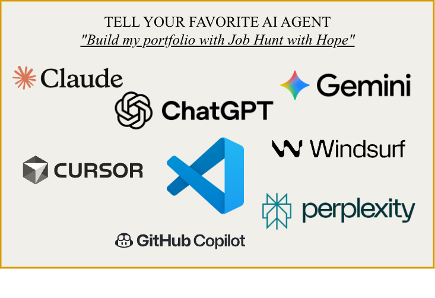
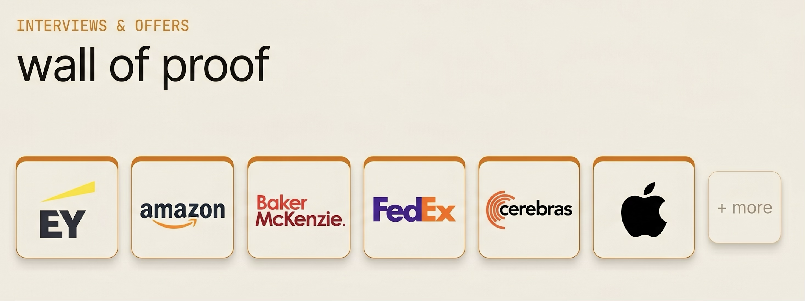
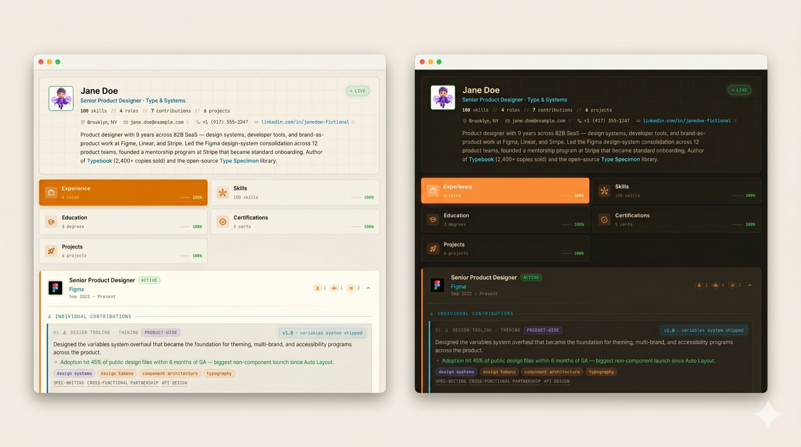
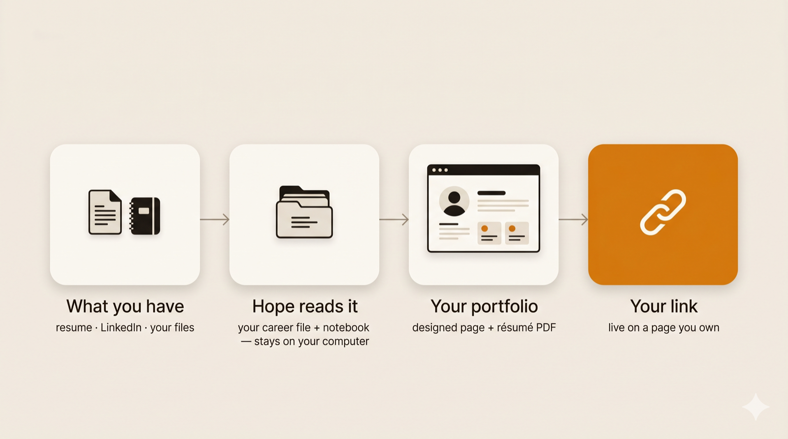

# JobHunt with Hope

> **AI already changed hiring. Use it to get hired.** Free job-hunt skills for any AI agent — no coding, no catch.

Free · open-source (MIT) · works with the AI you already use (ChatGPT · Claude · Gemini · Copilot…) · your data never leaves your laptop

<!-- IMAGE: any-agent — agent-agnostic hero (user-provided) -->
<p align="center"></p>

**The hiring side already runs on AI** — résumé screeners, ranking, instant auto-rejects. Doing your whole hunt by hand, alone, while everyone else has help, is how you fall behind. The candidate who let AI carry the heavy lifting already hit submit.

Hope hands your AI a set of **free skills** so it can actually *market you*: a portfolio recruiters stop scrolling for, a résumé that beats the bots and still reads human, and **one link you own**.

You don't need to code. You don't need an IDE. **If you can chat with an AI, you can do this.**

<!-- IMAGE: demo — the live multi-persona demo (recorded GIF) -->
<p align="center"></p>

<!-- IMAGE: proof — real interviews/offers (owner-supplied) -->
<p align="center"></p>

<p align="center"><sub>Built while job-hunting. <strong>85.5% of its earlier users landed multiple interviews and secured full-time roles.</strong></sub></p>

## Who this is for

- **Just laid off?** Get a real presence back up *today* — not after three weeks of fighting a blank page.
- **Switching fields?** Tell your story for the job you *want*, not the one you left. Hope reframes what you've done around where you're going.
- **First job, or fresh out of school?** Look like a pro before you've had the title — the work you *have* done, shown like it counts.

No account with us. No subscription to us. You bring the AI you already use; Hope is free.

## What it does for you

You talk; your AI builds your job-hunt presence:

- **A site recruiters stop scrolling for** — a designed portfolio with a living timeline of your career that visitors can play, hover, and click. Busy years rise like mountain peaks; a little character of your choice travels it. Not a form, not a template — a page that looks like you tried.
- **A résumé that beats the bots and still reads human** — pick a style and font; key phrases bolded for the 7-second skim; links clickable; text never too small to read. The screening software parses it cleanly, and a person actually wants to read it.
- **One link that makes you look hireable everywhere you paste it** — published free to a page in *your* name. Drop it on LinkedIn and it unfurls with your own preview card. Visitors see a finished site; only you can change it.

<!-- IMAGE: portfolio-hero -->
<p align="center"></p>

## Your data stays yours

Your facts live in one file on your computer: `career.json`. Hope keeps a small notebook too — `user-story.md`, how you like to work. Both are yours: open them, edit them, delete them. **No tracking. No accounts. Nothing leaves your machine** except the page you choose to publish.

<!-- IMAGE: data-stays-home -->
<p align="center"></p>

## How to use it

Hope ships as a one-command plugin for **[Claude Code](https://claude.com/claude-code)** — but it's just plain skills and scripts, so **any capable AI agent can run it.**

- **Claude Code / Claude desktop** — install in one command:
  ```
  /plugin marketplace add oneconsciousness/job-hunt-with-hope
  /plugin install hope@hope
  ```
- **Any other agent** (Cursor, GitHub Copilot, ChatGPT / Codex, Gemini, Windsurf, Perplexity…) — point it at this repo and say **"build my portfolio with Job Hunt with Hope."** It reads the skills and follows them.

Then, in a fresh chat in an empty folder:

1. Say **start my job hunt with Hope.**
2. Hand it whatever you have — an old résumé, your LinkedIn, your GitHub, a folder of files, or just talk. Hope does the work and walks you to your live link.

> **What you need:** any capable AI agent (most have a free tier or a paid plan). Hope itself is free.

<!-- IMAGE: how-hope-works -->
<p align="center"></p>

## How to update

- **Your portfolio:** say **update my portfolio** — Hope asks what changed (your story, the look, what's featured) and offers the newest features. Then say **publish the changes** — same page, same link.
- **Hope itself:** rerun the install. In Claude Code:
  ```
  /plugin uninstall hope@hope && /plugin install hope@hope
  ```
  (with another agent, re-pull this repo.) Then start a fresh chat so the newest Hope loads. Nothing is lost — everything lives in your folder, and Hope hands you a short summary to carry into the new chat.

## Roadmap

This release does **presentation** — portfolio, résumé, publish — and does it well. Coming in later releases: weighing roles, tailored cover letters, applying with care, interview prep, negotiation support, deciding, and a dashboard across all of it.

<!-- IMAGE: roadmap -->
<p align="center"></p>

## Who made this, and why

I built Hope while job-hunting myself. It's been evolving since 2023 — born inside my startup **CareerX, Inc.** on early ChatGPT, rebuilt across many models and stacks since, and grown into **Agent Hope, an agentic career manager for humans**. This skill, runnable by whatever AI you already use, is its best form yet. Tools that do good should meet people wherever they are — so Hope is free, and it stays that way.

## How to contribute

Found something broken, or want to build on Hope? **Reach out on LinkedIn: [in/arunganpa24](https://www.linkedin.com/in/arunganpa24).**

If you work with a coding agent, [`CONTRIBUTING.md`](CONTRIBUTING.md) is written for it — and the design and voice that make Hope feel like Hope live in [`references/`](references/).

## Like it?

**Leave a ⭐ on this repo and share the link.** Every share puts a free portfolio within reach of someone who needs work.

## License

MIT. See [`LICENSE`](LICENSE). Free to use, change, and share. Hope stands on the work of others — see [`CREDITS.md`](CREDITS.md).

---

If you need work, point your AI at this and start.
